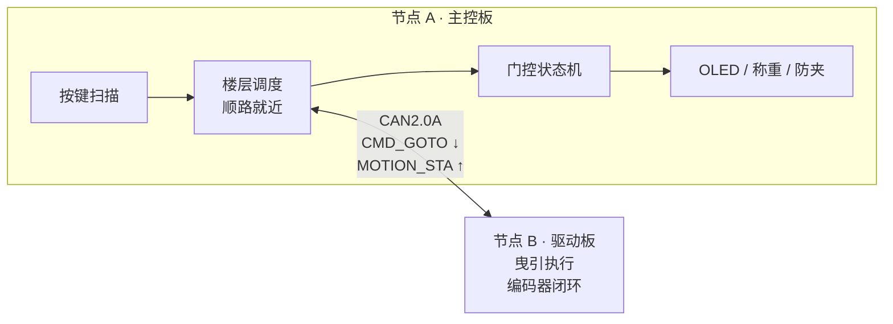

# 基于 STM32F103 + FreeRTOS 的分布式电梯控制系统

> 主控 + 驱动**双节点**架构的电梯控制系统，两节点之间通过 **CAN2.0A 总线**通信。
> 主控负责任务调度、人机交互与安全逻辑；驱动节点专责曳引执行。
> 用一根双绞线替代传统电梯的随行电缆，解决线束繁杂、抗干扰弱的问题。

**技术栈**：`STM32F103` `FreeRTOS` `CAN2.0A` `ADC+DMA` `TIM-PWM` `I2C` `HX711` `状态机` `HAL`

---

## 📌 当前进度

| 模块 | 状态 |
|---|---|
| FreeRTOS 多任务调度框架 | ✅ 完成 |
| 电梯业务逻辑（顺路就近调度 / 开关门 / 防夹） | ✅ 完成 |
| ADC+DMA 传感器采集、HX711 称重、OLED 显示 | ✅ 完成 |
| CAN2.0A 协议栈（ID 仲裁 / 位段划分 / 收发中断） | ✅ 完成 |
| CAN 链路与协议验证（**回环模式 + 本地执行器模拟**） | ✅ 完成 |
| CAN 真实双节点联调 | 🚧 硬件到位后进行 |
| 霍尔编码器 + 串级 PID 闭环曳引 | 🚧 硬件到位后进行 |

> 驱动板与电机尚未到位，当前采用 **回环模式 + 本机曳引模拟** 完成协议与业务逻辑的
> 软件在环（SIL）验证：下行指令与上行状态帧**完整跑通 CAN 链路**，只是对端是回环中的自身。
> 硬件到位后只需切换 `WORK_MODE` 宏，业务代码零改动。

---

## ✨ 功能特性

- **分布式架构**：主控 / 驱动双节点，CAN 总线通信，自定义应用层协议
- **多任务实时调度**：FreeRTOS 划分 6 个任务，按实时性需求分配优先级
- **顺路就近调度算法**：按运行方向优先选取最近楼层，支持运行中动态改写终点
- **渐进式关门 + 全程防夹**：关门过程中任意时刻检测到阻挡立即回弹开门
- **实时称重**：HX711 两点标定 + 滑动平均滤波
- **三级容错**：状态帧喂狗 + 命令重发 + 超时故障上报（应对分布式命令丢失）
- **安全联锁**：门未关好不允许曳引运行

---

## 🏗 系统架构



**解耦要点**：主控只下发"去 N 楼"，**完全不知道脉冲、PID、加减速的存在**；
加减速、平层、到位判定全部由驱动节点内部完成。这也是真实电梯
（主控柜 ↔ 变频器）的架构。

---

## 🔧 硬件清单

| 器件 | 数量 | 说明 |
|---|---|---|
| STM32F103C8T6 最小系统 | 2 | 主控节点 + 驱动节点 |
| TJA1050 / SN65HVD230 CAN 收发模块 | 2 | 总线两端各接 120Ω 终端电阻 |
| SSD1306 OLED（I2C，128×64） | 1 | 楼层 / 门状态 / 重量显示 |
| HX711 + 电阻应变片称重传感器 | 1 | 1kg 量程 |
| SG90 舵机 | 1 | 门机，50Hz PWM |
| 4×4 矩阵按键 | 1 | 选层输入 |
| 红外 / 压力传感器 | 3 | 防夹检测（3 路 ADC） |
| TB6612FNG + 霍尔编码器减速电机 | 1 | 🚧 曳引执行，待到位 |
| 微动限位开关 | 2 | 🚧 上下限位，待到位 |

### 主控板引脚分配

| 外设 | 引脚 | 说明 |
|---|---|---|
| ADC1_IN0/1/2 | PA0 / PA1 / PA2 | 3 路防夹检测，DMA 循环搬运 |
| HX711 | PA4(SCK) / PA5(DOUT) | 称重 |
| TIM3 CH1 | PA6 | 舵机 PWM，50Hz（500~2500µs → 0~180°） |
| CAN1 | PA11 / PA12 | 需经 TJA1050 收发器 |
| OLED（软件 I2C） | PB8(SCL) / PB9(SDA) | |
| 4×4 按键行（输出） | PB12 / PB13 / PB14 / PB15 | |
| 4×4 按键列（输入） | PA8 / PA9 / PA10 / PA15 | |

---

## 🧵 任务划分（FreeRTOS）

| 任务 | 优先级 | 周期 | 职责 |
|---|---|---|---|
| `can` | idle+5 | 事件驱动 | CAN 收发与协议分派（**最高，通信帧不能丢**） |
| `door` | idle+4 | 50 ms | 门控状态机 + 楼层调度 |
| `input` | idle+3 | 20 ms | 按键扫描 + OLED 刷新 |
| `traction` | idle+3 | 50 ms | 曳引执行（当前为本地模拟） |
| `sensor` | idle+2 | 20 ms | ADC+DMA 数据采集 |
| `weight` | idle+1 | 50 ms | HX711 称重 |

**同步机制**
- **队列**：按键 → 业务逻辑解耦；CAN 中断 → 解析任务
- **二值信号量**：ADC+DMA 完成中断 → 采集任务（`xSemaphoreGiveFromISR`）
- **临界区**：保护多任务共享的楼层请求缓冲区与刷新标志

---

## 📡 CAN 通信协议

标准帧 11 位 ID 位段划分：

```
[10:8]  消息类型      [7:4]  源节点      [3:0]  目标节点
```

> **CAN 仲裁规则：ID 数值越小优先级越高**，因此按实时性倒排 —— 急停帧 ID 最小，可抢占总线。

| 消息 | 类型值 | 方向 | 数据域 |
|---|---|---|---|
| `MSG_EMERGENCY` | 0（仲裁优先级最高） | 曳引 → 主控 | `[0]` 故障码 |
| `MSG_MOTION_STA` | 1 | 曳引 → 主控 | `[0]`当前层 `[1]`运行状态 `[2]`方向 |
| `MSG_WEIGHT` | 2 | 曳引 → 主控 | `[0][1]`重量 `[2]`超载标志 |
| `MSG_DOOR_OK` | 3 | 主控 → 曳引 | `[0]`=1 允许运行（安全联锁） |
| `MSG_CMD_GOTO` | 4 | 主控 → 曳引 | `[0]` 目标楼层 |

**波特率**：125 kbps（`PCLK1=36MHz`，`PSC=36`，`BS1=5TQ`，`BS2=2TQ`，采样点 **75%**）

---

## 📁 目录结构

```
MXtext/
├── Core/
│   ├── Inc/          app.h(任务与配置) main.h can.h ...
│   └── Src/          app.c(业务与CAN服务层) main.c can.c tim.c adc.c ...
├── BSP/
│   ├── bottun/       4x4 矩阵按键驱动
│   ├── door/         SG90 舵机驱动
│   ├── HX117/        HX711 称重驱动
│   └── OLED/         SSD1306 软件 I2C 驱动
├── Middlewares/      FreeRTOS
├── Drivers/          CMSIS / STM32F1xx HAL
├── MDK-ARM/          Keil 工程
└── MXtext.ioc        CubeMX 配置（可直接改引脚后重新生成）
```

---

## 🚀 快速开始

1. 用 **Keil MDK** 打开 `MDK-ARM/MXtext.uvprojx`
2. 按需修改 `Core/Inc/app.h` 中的运行模式：

```c
#define MODE_PURE_LOCAL  0   /* 完全不用CAN，纯本地延时逻辑 */
#define MODE_LOCAL_SIM   1   /* 单板自测：CAN回环 + 本地曳引模拟【默认】 */
#define MODE_DUAL_NODE   2   /* 真双节点 */

#define WORK_MODE   MODE_LOCAL_SIM
```

3. 编译烧录。两块板联调时改 `MODE_DUAL_NODE`，并确认：
   - 两个节点 **CANH-CANH、CANL-CANL** 对接
   - 总线两端各接 **120Ω 终端电阻**
   - 两板 **共地**

---

## 🕳 踩坑记录

这部分记录的是实际调试中真实踩过的坑，也是这个项目最有价值的部分。

**1. CubeMX 不生成 CAN 中断服务函数**
`HAL_CAN_ActivateNotification()` 开了中断，但 `stm32f1xx_it.c` 里根本没有 ISR，
接收回调永远进不去。必须手写：

```c
void USB_LP_CAN1_RX0_IRQHandler(void) { HAL_CAN_IRQHandler(&hcan); }
```

**2. CubeMX 也没开 CAN 的 NVIC**
`HAL_CAN_MspInit()` 只开了时钟和 GPIO，需要手动 `HAL_NVIC_EnableIRQ()`。

**3. FreeRTOS 下中断优先级不能乱设**
`configLIBRARY_MAX_SYSCALL_INTERRUPT_PRIORITY = 5`，CAN 接收中断优先级
**必须 ≥ 5**（数值上），否则在中断里调用 `xQueueSendFromISR` 会触发断言失败。

**4. 单机调试 CAN 必须开回环模式**
总线上没有第二个节点时，发出的帧**收不到 ACK 应答**，硬件会一直重发直至失败。
现象是"发送函数返回了，但对端什么都没收到"。单板调试务必用 `CAN_MODE_LOOPBACK`。

**5. CAN 采样点设成 50% 会在干扰环境下错帧**
最初配置 `BS1=2TQ / BS2=3TQ`，采样点只有 **50%**（标准为 75%~87.5%）。
改成 `PSC=36 / BS1=5TQ / BS2=2TQ` 后采样点 75%，波特率 125kbps。

**6. 分布式命令丢失导致状态机死锁（最严重的一个）**
主控下发命令后进入 `RUN` 状态死等"到站"帧。一旦命令帧或状态帧在发送邮箱 /
队列中丢失，主控将**永久卡死**。修复方式：
- `Can_Send()` 返回成功/失败，不再静默丢弃
- 收到任何状态帧即**喂狗**；2s 无状态帧 → **自动重发命令**；连续 3 次无响应 → 上报故障并回停靠态
- 命令队列深度 4 → 8，接收队列 8 → 16

**7. 执行器不支持中途改终点，导致"冲过头"**
原实现中目标层被锁死在局部变量，运行中新下发的命令只能排队，
必须跑完旧目标才生效 —— 表现为"按了 5 楼却先冲到 10 楼再下来"。
修复：执行任务改为**每 50ms 检查一次命令队列**，新目标立即生效。

**8. 楼层状态的权威必须唯一**
主控曾用本地变量算楼层，与执行侧不同步，导致调度算法用"过期楼层"做决策。
修复：楼层状态以**执行侧上报为准**（它有编码器），主控只做镜像。

---

## 🗺 后续计划

- [ ] CAN 真实双节点联调（驱动板独立工程）
- [ ] 霍尔编码器 + 位置环/速度环串级 PID
- [ ] 梯形加减速曲线 + 平层算法
- [ ] 井道自学习（上电自动标定各楼层绝对脉冲坐标，存 Flash）
- [ ] 端站限位校正，消除累积误差
- [ ] 超载报警（HX711 阈值判断 + 蜂鸣器）
- [ ] 独立看门狗 + CAN 心跳超时保护
- [ ] 抽取 `can_protocol.h` 为双工程共用协议头

---

## 📄 License

MIT
