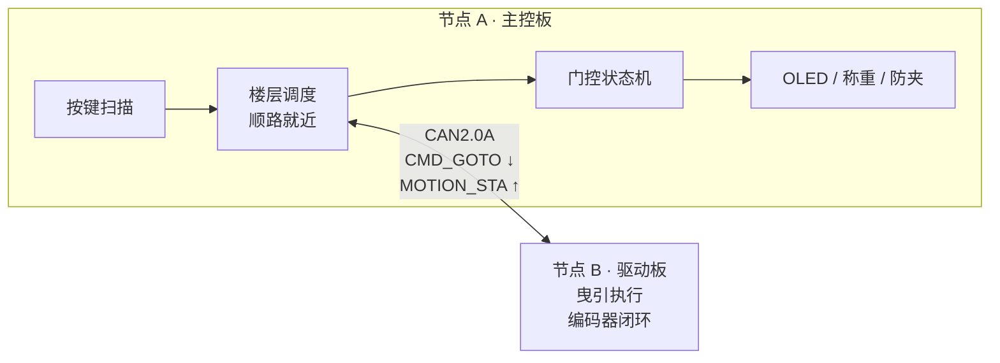

# 🛗 分布式电梯控制系统 · STM32F103 + FreeRTOS


> **主控 + 驱动双节点**架构的电梯控制系统，两个节点之间通过 **CAN 2.0A** 总线通信。
> 主控负责调度、人机交互与安全逻辑；驱动节点专责曳引执行。
> 用**一根双绞线**替代传统电梯的随行电缆，解决线束繁杂、抗干扰弱的问题。

**技术栈**：`STM32F103` · `FreeRTOS` · `CAN 2.0A` · `ADC+DMA` · `TIM-PWM` · `TIM-Encoder` · `I2C` · `HX711` · `状态机` · `HAL`

---

## 📦 仓库结构

本仓库并列存放两个**独立可编译**的 Keil 工程，按板分目录：

| 目录 | 节点 | 角色 | 工程入口 |
|:---:|:---:|---|---|
| [`A板/`](A板) | **A · 主控** | 调度 / 门控 / 称重 / 显示（FreeRTOS 多任务） | `A板/MDK-ARM/MXtext.uvprojx` |
| [`B板/`](B板) | **B · 驱动** | 曳引执行 / 位置闭环（裸机 + 定时器节拍） | `B板/MDK-ARM/fastdianji.uvprojx` |

---

## 📌 当前进度

| 模块 | 状态 |
|---|:---:|
| FreeRTOS 多任务调度框架 | ✅ 完成 |
| 电梯业务逻辑（顺路就近调度 / 开关门 / 防夹） | ✅ 完成 |
| ADC+DMA 传感器采集、HX711 称重、OLED 显示 | ✅ 完成 |
| CAN 2.0A 协议栈（ID 仲裁 / 位段划分 / 收发中断） | ✅ 完成 |
| CAN 链路与协议验证（回环模式 + 本地执行器模拟） | ✅ 完成 |
| 驱动节点 B：曳引状态机 + 编码器位置闭环 | ✅ 代码完成 |
| 驱动节点 B：堵转 / 反向 / 超时三重故障保护 | ✅ 代码完成 |
| CAN 真实双节点联调（两板对拉） | ✅ 代码完成 |
| 串级 PID（当前为位置闭环 + 分段速度给定） | ✅ 代码完成 |

> 驱动板与电机尚未到位时，A 板用 **回环模式 + 本机曳引模拟** 完成协议与业务逻辑的
> 软件在环（SIL）验证：下行指令与上行状态帧**完整跑通 CAN 链路**，只是对端是回环中的自身。
> 硬件到位后只需切换 `WORK_MODE` 宏，业务代码零改动。

---

## ✨ 功能特性

**主控节点 A**

- **多任务实时调度**：FreeRTOS 划分 6 个任务，按实时性需求分配优先级
- **顺路就近调度算法**：按运行方向优先选取最近楼层，支持运行中动态改写终点
- **渐进式关门 + 全程防夹**：关门过程中任意时刻检测到阻挡立即回弹开门
- **实时称重**：HX711 两点标定 + 滑动平均滤波
- **三级容错**：状态帧喂狗 + 命令重发 + 超时故障上报（应对分布式命令丢失）
- **安全联锁**：门未关好不允许曳引运行

**驱动节点 B**

- **位置闭环曳引**：编码器脉冲计数闭环，远程巡航 + 近程线性降速，到站窗口 + 过冲判据双条件
- **楼层网格重挂**：每成功到站一次即把绝对位置重新锚定到楼层网格，消除多次运行的累积误差
- **三重故障保护**：堵转 / 编码器断线（600 ms 无脉冲）、反向跑（误差连续 1 s 变大）、单程总超时
- **无串口调试**：板载 LED 用「闪 N 次 = 故障码 N」播报状态，配合 Keil Watch 观测点定位问题
- **三种单板自测模式**：CAN 回环、台架自动跑楼、编码器独立自检

---

## 🏗 系统架构



**解耦要点**：主控只下发「去 N 楼」，**完全不知道脉冲、PWM、加减速的存在**；
加减速、平层、到位判定全部由驱动节点内部完成。这也是真实电梯
（主控柜 ↔ 变频器）的架构。

**楼层权威唯一**：轿厢真实位置只有一个来源 —— 驱动节点 B 的编码器。
A 板只镜像 B 上报的楼层，绝不用本地变量自行推算（否则调度算法会拿到过期楼层做决策）。

---

## 🔧 硬件清单

| 器件 | 数量 | 说明 |
|:---:|:---:|---|
| STM32F103C8T6 最小系统 | 2 | 主控节点 + 驱动节点 |
| TJA1050 / SN65HVD230 CAN 收发模块 | 2 | 总线两端各接 120Ω 终端电阻 |
| SSD1306 OLED（I2C，128×64） | 1 | 楼层 / 门状态 / 重量显示 |
| HX711 + 电阻应变片称重传感器 | 1 | 1 kg 量程 |
| SG90 舵机 | 1 | 门机，50 Hz PWM |
| 4×4 矩阵按键 | 1 | 选层输入 |
| 红外 / 压力传感器 | 3 | 防夹检测（3 路 ADC） |
| TB6612FNG + 霍尔编码器减速电机 | 1 | 曳引执行（11 PPR × 377:1 减速比） |
| 微动限位开关 | 2 | 🚧 上下限位，待接入 |

### 主控板（节点 A）引脚分配

| 外设 | 引脚 | 说明 |
|---|---|---|
| ADC1_IN0/1/2 | PA0 / PA1 / PA2 | 3 路防夹检测，DMA 循环搬运 |
| HX711 | PA4(SCK) / PA5(DOUT) | 称重 |
| TIM3 CH1 | PA6 | 舵机 PWM，50 Hz（500 ~ 2500 µs → 0 ~ 180°） |
| CAN1 | PA11 / PA12 | 需经 TJA1050 收发器 |
| OLED（软件 I2C） | PB8(SCL) / PB9(SDA) | |
| 4×4 按键行（输出） | PB12 / PB13 / PB14 / PB15 | |
| 4×4 按键列（输入） | PA8 / PA9 / PA10 / PA15 | |

### 驱动板（节点 B）引脚分配

| 外设 | 引脚 | 说明 |
|---|---|---|
| TB6612 PWMA | PA8（TIM1_CH1） | 10 kHz PWM（`PSC=0`，`ARR=7199`） |
| TB6612 AIN1 / AIN2 | PB0 / PB1 | 方向控制位 |
| TB6612 STBY | PB5 | 驱动器总使能 |
| 编码器 A / B 相 | PA0 / PA1（TIM2_CH1/CH2） | 编码器模式 `TI12`（**四倍频**），A/B 相内部上拉 |
| CAN1 | PB8(RX) / PB9(TX) | ❗**重映射引脚**，必须 `__HAL_AFIO_REMAP_CAN1_2()` |
| 板载 LED | PC13 | 低电平点亮，故障码播报 |
| 系统节拍 | TIM3 | 10 ms 中断（`PSC=7199`，`ARR=99`） |

---

## 🧵 任务划分（节点 A · FreeRTOS）

| 任务 | 优先级 | 周期 | 职责 |
|---|:---:|:---:|---|
| `can` | idle+5 | 事件驱动 | CAN 收发与协议分派（**最高，通信帧不能丢**） |
| `door` | idle+4 | 50 ms | 门控状态机 + 楼层调度 |
| `input` | idle+3 | 20 ms | 按键扫描 + OLED 刷新 |
| `traction` | idle+3 | 50 ms | 曳引执行（当前为本地模拟） |
| `sensor` | idle+2 | 20 ms | ADC+DMA 数据采集 |
| `weight` | idle+1 | 50 ms | HX711 称重 |

**同步机制**

- **队列**：按键 → 业务逻辑解耦；CAN 中断 → 解析任务
- **二值信号量**：ADC+DMA 完成中断 → 采集任务（`xSemaphoreGiveFromISR`）
- **临界区**：保护多任务共享的楼层请求缓冲区与刷新标志

> 节点 B **不使用 RTOS**：它的实时链路是一条严格定序的 10 ms 中断
> （测速 → PWM 爬升 → 曳引状态机），用裸机中断反而比多任务更好保证时序确定性。

---

## 📡 CAN 通信协议

标准帧 11 位 ID 位段划分：

```
[10:8]  消息类型      [7:4]  源节点      [3:0]  目标节点
```

> **CAN 仲裁规则：ID 数值越小优先级越高**，因此按实时性倒排 —— 急停帧 ID 最小，可抢占总线。

| 消息 | 类型值 | 帧 ID | 方向 | 数据域 |
|---|:---:|:---:|:---:|---|
| `MSG_EMERGENCY` | 0（仲裁优先级最高） | `0x021` | 驱动 → 主控 | `[0]` 故障码 |
| `MSG_MOTION_STA` | 1 | `0x121` | 驱动 → 主控 | `[0]` 当前层 `[1]` 运行状态 `[2]` 方向 |
| `MSG_WEIGHT` | 2 | `0x212` | 驱动 → 主控 | `[0][1]` 重量 `[2]` 超载标志 |
| `MSG_DOOR_OK` | 3 | `0x312` | 主控 → 驱动 | `[0]`=1 允许运行（安全联锁） |
| `MSG_CMD_GOTO` | 4 | `0x412` | 主控 → 驱动 | `[0]` 目标楼层 |

**波特率**：125 kbps（`PCLK1=36 MHz`，`PSC=48`，`BS1=2TQ`，`BS2=3TQ`，`SJW=2TQ`，采样点 50%）

> ⚠️ 两个节点的位时序必须**逐参数一致**，任一参数不同都会导致采样时刻错位。
> A、B 两个工程当前使用完全相同的一套配置，改动时务必两边同改。

协议定义的唯一权威是 `B板/Core/Inc/can_proto.h`（B 板侧），
A 板侧原始定义在 `A板/Core/Src/app.c` 中 —— 两者必须保持同步。

---

## 📁 目录结构

```
MXtext/                        ← 仓库根
├── README.md                  ← 本文档
│
├── A板/                       ← 主控节点 A（独立 Keil 工程）
│   ├── Core/
│   │   ├── Inc/     app.h(任务与配置) main.h can.h ...
│   │   └── Src/     app.c(业务与 CAN 服务层) main.c can.c tim.c adc.c ...
│   ├── BSP/
│   │   ├── bottun/  4×4 矩阵按键驱动
│   │   ├── door/    SG90 舵机驱动
│   │   ├── HX117/   HX711 称重驱动
│   │   └── OLED/    SSD1306 软件 I2C 驱动
│   ├── Middlewares/ FreeRTOS
│   ├── Drivers/     CMSIS / STM32F1xx HAL
│   ├── MDK-ARM/     Keil 工程（节点 A）
│   └── MXtext.ioc   CubeMX 配置（可改引脚后重新生成）
│
└── B板/                       ← 驱动节点 B（独立 Keil 工程）
    ├── Core/
    │   ├── Inc/     traction.h(曳引接口) can_proto.h(协议契约·权威) motor.h encoder.h ...
    │   └── Src/     traction.c(状态机+位置闭环) motor.c(TB6612+软启动)
    │                encoder.c(四倍频测速+自检标定) can.c(收发+重映射)
    ├── Drivers/     CMSIS / STM32F1xx HAL
    ├── MDK-ARM/     Keil 工程（节点 B）
    └── fastdianji.ioc
```

---

## 🎢 驱动节点 B：曳引闭环实现

### 控制节拍

全部实时逻辑挂在 **TIM3 的 10 ms 中断**里，顺序固定不可调换：

```
Encoder_Update()    →  读 TIM2 计数，算增量与转速
Motor_Loop()        →  PWM 占空比按步长软启动爬升
Traction_Tick()     →  曳引状态机 + 位置闭环 + 置上报标志
Traction_DbgSync()  →  刷新调试观测点（不参与控制）
```

主循环只做一件事：`Traction_Poll()` 把中断置好的上报请求真正发到总线上。
**中断里绝不做会产生等待的操作**（CAN 发送要等 ACK，最长会阻塞 5 ms）。

### 编码器测速

- TIM2 编码器模式 `TI12`：A/B 两相都计数 → **四倍频**
- M 法测速：每 10 ms 取一次增量，`rpm = delta × 6000 / COUNTS_PER_OUTPUT_REV`
- 16 位计数器自然回绕，用 `int16_t` 直接相减即可跨回绕，无需特殊处理
- 理论上限 = 11 PPR × 4 × 377 ≈ 16588 脉冲/输出轴圈，**实测标定为 15916**

> 编码器 A/B 相额外开了**内部上拉**：悬空时不会被噪声翻来翻去，
> 同时兼容开漏输出的霍尔编码器。

### 位置闭环策略

不是 PID，是**「远程巡航 + 近程线性降速」的分段给定**：

```
abs_err ≥ 半层  →  占空比 55%（巡航）
abs_err < 半层  →  占空比从 55% 线性降到 28%（下限，再低克服不了静摩擦）
```

到站判据用**两条**任一成立（高速时一拍可能整拍跨过目标层）：

1. 位置误差进入 ±150 脉冲的到站窗口
2. 本拍误差符号相对上一拍翻转（跨过目标）

到站后 **刹停 + 把绝对位置重新锚定到楼层网格**，下一次运行的误差从零开始累积。

### 故障保护

| 故障码 | 触发条件 | 值 |
|---|---|:---:|
| `FAULT_DOOR_NOT_OK` | 收到目标层但联锁窗口内没有 `DOOR_OK` | 1 |
| `FAULT_BAD_TARGET` | 目标楼层越界 | 2 |
| `FAULT_ENCODER_LOST` | 占空比已到位却连续 600 ms 无脉冲（堵转 / 断线） | 3 |
| `FAULT_MOVE_TIMEOUT` | 单程总超时（100 s 兜底） | 4 |
| `FAULT_REMOTE_STOP` | 收到主控急停，半途停住 | 5 |
| `FAULT_WRONG_DIR` | 误差连续 1 s 变大（A/B 相接反或方向映射配错） | 6 |

任一故障 → 立刻 `Motor_Brake()` + 上报 `MOTION_STA(FAULT)` 与 `EMERGENCY(码)`，
主控随之退回重新调度，**不会死锁**。

### 调试手段（本板无串口）

1. **板载 LED 闪码**：上电先常亮 600 ms（证明 LED 是好的），之后故障时「闪 N 次 = 故障码 N」；
   无故障时每累计 500 个编码器脉冲闪一下（兼作编码器心跳）。
2. **Keil Watch 观测点**：`View → Watch 1` 输入 `g_dbg`（或独立标量 `g_dbg_pos` / `g_dbg_delta` /
   `g_dbg_ticks` / `g_dbg_arr_err`），并勾选 `Periodic Window Update` 实时刷新。
   - `g_dbg_delta` 恒为 0 → 编码器没信号
   - `g_dbg_ticks` 不涨 → 程序没在跑，此时看到的任何 0 都不可信
   - `g_dbg_arr_err` 到站残余误差，正常应在 ±100 脉冲内；达到几千说明控制环没收敛

---

## 🚀 快速开始

### 环境要求

- Keil MDK-ARM v5 + STM32F1xx DFP 器件包
- STM32CubeMX（可选，仅需改引脚重新生成时使用）
- ST-Link / DAP-Link 下载器

### 节点 A（主控）

1. Keil MDK 打开 `A板/MDK-ARM/MXtext.uvprojx`
2. 按需修改 `A板/Core/Inc/app.h` 中的运行模式：

```c
#define MODE_PURE_LOCAL  0   /* 完全不用 CAN，纯本地延时逻辑 */
#define MODE_LOCAL_SIM   1   /* 单板自测：CAN 回环 + 本地曳引模拟 */
#define MODE_DUAL_NODE   2   /* 真双节点：A 只管调度，升降由驱动板 B 执行【默认】 */

#define WORK_MODE   MODE_DUAL_NODE
```

3. 编译、烧录

### 节点 B（驱动）

1. Keil MDK 打开 `B板/MDK-ARM/fastdianji.uvprojx`
2. 单板自测（不接 A 板）时，在 `B板/Core/Inc/can.h` 打开回环，
   并在 `B板/Core/Inc/traction.h` 打开台架自动跑楼：

```c
#define CAN_LOOPBACK_TEST   1   /* 回环模式：无第二节点时必须有 ACK 才能发出 */
#define BENCH_AUTO_GOTO     1   /* 上电 1s 后自动给自己下「去 3 楼」的命令 */
```

3. 只验编码器（不接 A 板、不接电机、不需要万用表）时，打开：

```c
#define BENCH_ENCODER_TEST  1   /* 关掉驱动器让输出轴自由，手转轴看 LED 是否闪 */
```

> ❗`BENCH_ENCODER_TEST` 测完**务必改回 0**，否则 B 板不会响应 A 板。

### 双节点联调

1. A 板 `WORK_MODE = MODE_DUAL_NODE`，B 板两个自测开关都关掉
2. 接线：
   - `CANH — CANH`、`CANL — CANL`
   - **总线两端各接一个 120Ω 终端电阻**
   - **两板必须共地**
3. A 板下发选层 → B 板闭环跑楼 → 状态帧回报，A 板刷新楼层显示

---

## 🕳 踩坑记录

这部分记录的是实际调试中真实踩过的坑，也是这个项目最有价值的部分。

### 主控节点 A

**1. CubeMX 不生成 CAN 中断服务函数**
`HAL_CAN_ActivateNotification()` 开了中断，但 `stm32f1xx_it.c` 里根本没有 ISR，
接收回调永远进不去。必须手写：

```c
void USB_LP_CAN1_RX0_IRQHandler(void) { HAL_CAN_IRQHandler(&hcan); }
```

**2. CubeMX 也没开 CAN 的 NVIC**
`HAL_CAN_MspInit()` 只开了时钟和 GPIO，需要手动 `HAL_NVIC_EnableIRQ()`。

**3. FreeRTOS 下中断优先级不能乱设**
`configLIBRARY_MAX_SYSCALL_INTERRUPT_PRIORITY = 5`，CAN 接收中断优先级
**必须 ≥ 5**（数值上），否则在中断里调用 `xQueueSendFromISR` 会触发断言失败。

**4. 单机调试 CAN 必须开回环模式**
总线上没有第二个节点时，发出的帧**收不到 ACK 应答**，硬件会一直重发直至失败。
现象是「发送函数返回了，但对端什么都没收到」。单板调试务必用 `CAN_MODE_LOOPBACK`。

**5. CAN 采样点在 50% 与 75% 之间反复，当前统一为 50%**
最初配置 `BS1=2TQ / BS2=3TQ`，采样点只有 **50%**；调试中一度改成
`BS1=5TQ / BS2=2TQ`（采样点 75%，CiA 推荐值 75% ~ 87.5%）以求更高的抗干扰余量。
当前 A、B 两个节点统一采用 `PSC=48 / BS1=2TQ / BS2=3TQ / SJW=2TQ`，
125 kbps，采样点 50%，与驱动节点 B 及参考实现完全一致。

> 【待补：最终定回 50% 的实测依据 / 与 75% 的对比结论】

**6. 分布式命令丢失导致状态机死锁（最严重的一个）**
主控下发命令后进入 `RUN` 状态死等「到站」帧。一旦命令帧或状态帧在发送邮箱 /
队列中丢失，主控将**永久卡死**。修复方式：

- `Can_Send()` 返回成功/失败，不再静默丢弃
- 收到任何状态帧即**喂狗**；2 s 无状态帧 → **自动重发命令**；连续 3 次无响应 → 上报故障并回停靠态
- 命令队列深度 4 → 8，接收队列 8 → 16

**7. 执行器不支持中途改终点，导致「冲过头」**
原实现中目标层被锁死在局部变量，运行中新下发的命令只能排队，
必须跑完旧目标才生效 —— 表现为「按了 5 楼却先冲到 10 楼再下来」。
修复：执行任务改为**每 50 ms 检查一次命令队列**，新目标立即生效。

**8. 楼层状态的权威必须唯一**
主控曾用本地变量算楼层，与执行侧不同步，导致调度算法用「过期楼层」做决策。
修复：楼层状态以**执行侧上报为准**（它有编码器），主控只做镜像。

### 驱动节点 B

**9. B板因使用快充充电头导致B板PA11烧毁**
导致PA11相连的RX无法正常通信，现象为电压过低，收不到应答，后重映射到PB8,PB9
才让通信正常—— 极难查。

**10. 编码器 A/B 相悬空会把计数搅乱**
线还没接时 PA0/PA1 悬空，噪声会让 CNT 与转速乱跳。
解决：把两相改成**内部上拉**，悬空时稳定为高，不接编码器时计数恒为 0；
顺带兼容开漏输出的霍尔编码器。这段放在 `USER CODE` 段内，CubeMX 重新生成不会覆盖。

**11. 理论脉冲数 ≠ 实际脉冲数**
理论 = 11 PPR × 4 倍频 × 377 减速比 ≈ **16588**，但实测输出轴转整整一圈
只有 **15916** 个脉冲。按理论值算楼层，每层都会欠一点点，跑几趟就偏一层 ——
**必须实测标定**。（`B板/Core/Src/encoder.c` 里提供了 `Encoder_CalStart/CalStop` 自检标定流程）

**12. TB6612 刹车/滑行之后，方向脚不会自己恢复**
`Motor_Brake()` 会把 AIN1/AIN2 都置 1、`Motor_Coast()` 都置 0，两种情况 TB6612
输出都是关闭的。此后即使 STBY=1、PWM 也有占空比，**电机照样不转**。
修复：只要给了新的速度指令（占空比 > 0），就**重新写一次方向脚**。

---

